UML Diagram for Python Design Pattern Examples
===

This project lists UML diagrams of the "[Design Pattern Examples in Python](https://github.com/takaakit/design-pattern-examples-in-python)". When you click on a diagram image, the diagram will be opened in **Diagram Map**. If you want to know about Diagram Map, see [this post](https://dev.to/takaakit/diagram-map-tracing-uml-sysml-elements-across-diagrams-49i7).

Behavioral Patterns
---
|  |  |  |
| :---: | :---: | :---: |
| **Chain of Responsibility** | **Command** | **Interpreter** |
| <a href="https://htmlpreview.github.io/?https://github.com/takaakit/uml-diagram-for-python-design-pattern-examples/blob/master/behavioral_patterns/chain_of_responsibility/diagram_map.html">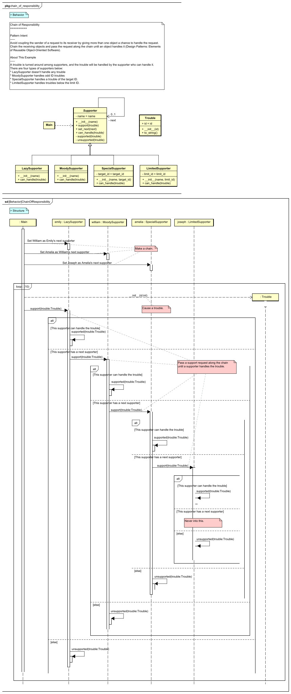</a> <a href="https://github.com/takaakit/design-pattern-examples-in-python/tree/master/behavioral_patterns/chain_of_responsibility">Python Code</a> <a href="./behavioral_patterns/chain_of_responsibility/execution_result.png">Execution Result</a> | <a href="https://htmlpreview.github.io/?https://github.com/takaakit/uml-diagram-for-python-design-pattern-examples/blob/master/behavioral_patterns/command/diagram_map.html">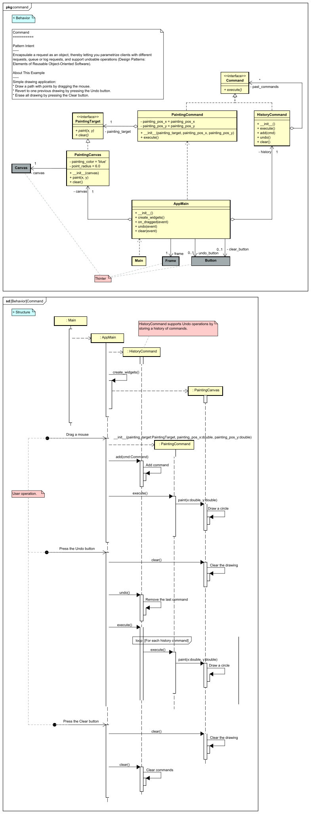</a> <a href="https://github.com/takaakit/design-pattern-examples-in-python/tree/master/behavioral_patterns/command">Python Code</a> <a href="./behavioral_patterns/command/execution_result.png">Execution Result</a> | <a href="https://htmlpreview.github.io/?https://github.com/takaakit/uml-diagram-for-python-design-pattern-examples/blob/master/behavioral_patterns/interpreter/diagram_map.html">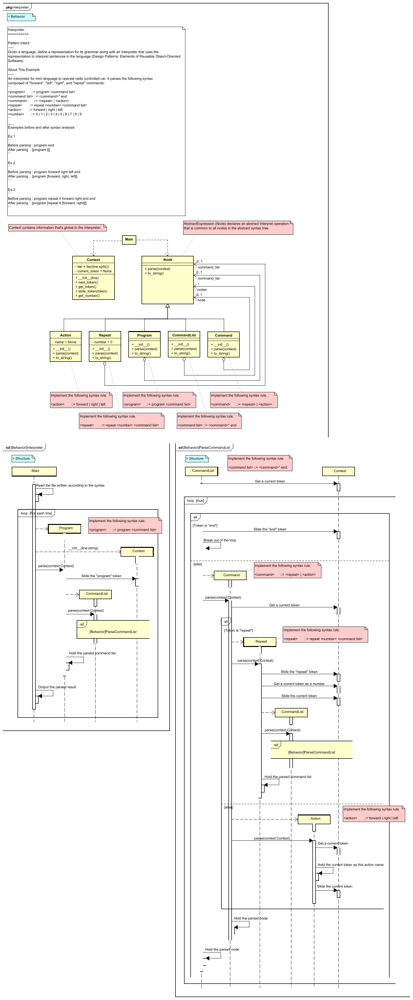</a> <a href="https://github.com/takaakit/design-pattern-examples-in-python/tree/master/behavioral_patterns/interpreter">Python Code</a> <a href="./behavioral_patterns/interpreter/execution_result.png">Execution Result</a> |
| **Iterator** | **Mediator** | **Memento** |
| <a href="https://htmlpreview.github.io/?https://github.com/takaakit/uml-diagram-for-python-design-pattern-examples/blob/master/behavioral_patterns/iterator/diagram_map.html">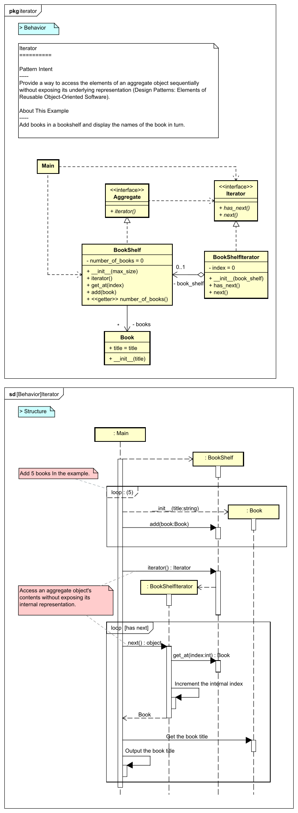</a> <a href="https://github.com/takaakit/design-pattern-examples-in-python/tree/master/behavioral_patterns/iterator">Python Code</a> <a href="./behavioral_patterns/iterator/execution_result.png">Execution Result</a> | <a href="https://htmlpreview.github.io/?https://github.com/takaakit/uml-diagram-for-python-design-pattern-examples/blob/master/behavioral_patterns/mediator/diagram_map.html">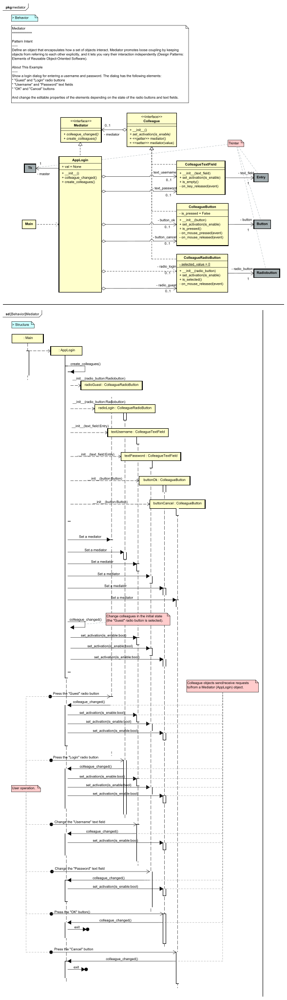</a> <a href="https://github.com/takaakit/design-pattern-examples-in-python/tree/master/behavioral_patterns/mediator">Python Code</a> <a href="./behavioral_patterns/mediator/execution_result.png">Execution Result</a> | <a href="https://htmlpreview.github.io/?https://github.com/takaakit/uml-diagram-for-python-design-pattern-examples/blob/master/behavioral_patterns/memento/diagram_map.html">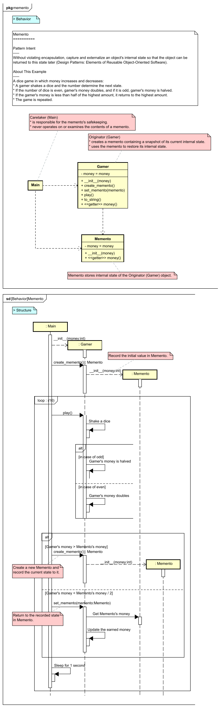</a> <a href="https://github.com/takaakit/design-pattern-examples-in-python/tree/master/behavioral_patterns/memento">Python Code</a> <a href="./behavioral_patterns/memento/execution_result.png">Execution Result</a> |
| **Observer** | **State** | **Strategy** |
| <a href="https://htmlpreview.github.io/?https://github.com/takaakit/uml-diagram-for-python-design-pattern-examples/blob/master/behavioral_patterns/observer/diagram_map.html">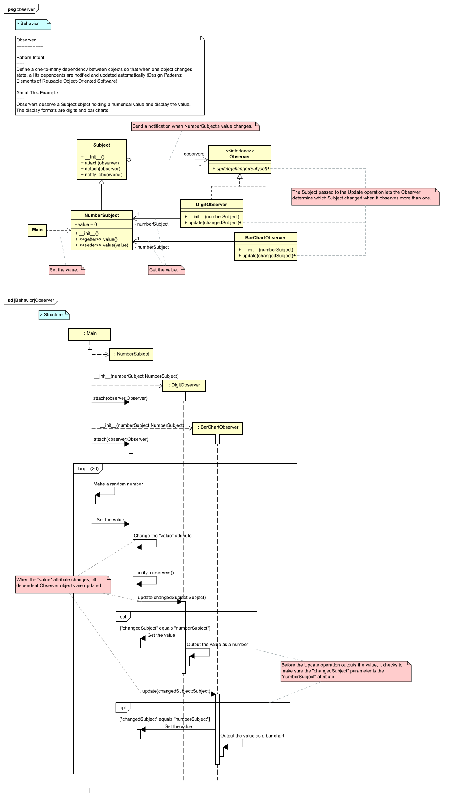</a> <a href="https://github.com/takaakit/design-pattern-examples-in-python/tree/master/behavioral_patterns/observer">Python Code</a> <a href="./behavioral_patterns/observer/execution_result.png">Execution Result</a> | <a href="https://htmlpreview.github.io/?https://github.com/takaakit/uml-diagram-for-python-design-pattern-examples/blob/master/behavioral_patterns/state/diagram_map.html">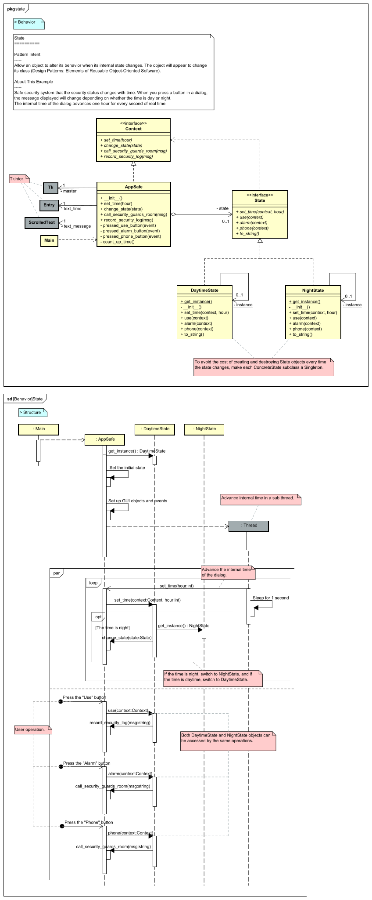</a> <a href="https://github.com/takaakit/design-pattern-examples-in-python/tree/master/behavioral_patterns/state">Python Code</a> <a href="./behavioral_patterns/state/execution_result.png">Execution Result</a> |  <a href="https://github.com/takaakit/design-pattern-examples-in-python/tree/master/behavioral_patterns/strategy">Python Code</a> <a href="./behavioral_patterns/strategy/execution_result.png">Execution Result</a> |
| **Template Method** | **Visitor** |  |
| <a href="https://htmlpreview.github.io/?https://github.com/takaakit/uml-diagram-for-python-design-pattern-examples/blob/master/behavioral_patterns/template_method/diagram_map.html">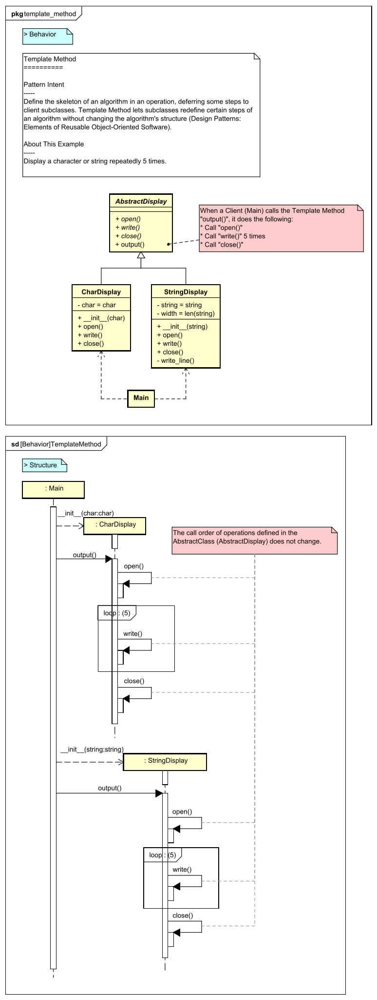</a> <a href="https://github.com/takaakit/design-pattern-examples-in-python/tree/master/behavioral_patterns/template_method">Python Code</a> <a href="./behavioral_patterns/template_method/execution_result.png">Execution Result</a> | <a href="https://htmlpreview.github.io/?https://github.com/takaakit/uml-diagram-for-python-design-pattern-examples/blob/master/behavioral_patterns/visitor/diagram_map.html">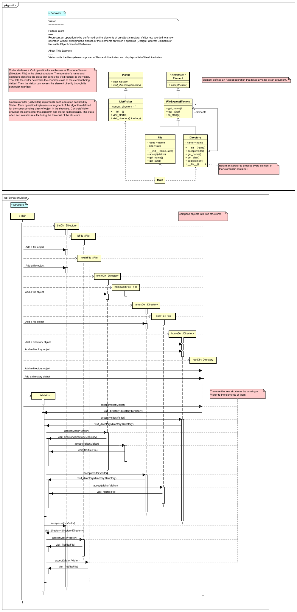</a> <a href="https://github.com/takaakit/design-pattern-examples-in-python/tree/master/behavioral_patterns/visitor">Python Code</a> <a href="./behavioral_patterns/visitor/execution_result.png">Execution Result</a> |  |

Creational Patterns
---
|  |  |  |
| :---: | :---: | :---: |
| **Abstract Factory** | **Builder** | **Factory Method** |
| <a href="https://htmlpreview.github.io/?https://github.com/takaakit/uml-diagram-for-python-design-pattern-examples/blob/master/creational_patterns/abstract_factory/diagram_map.html">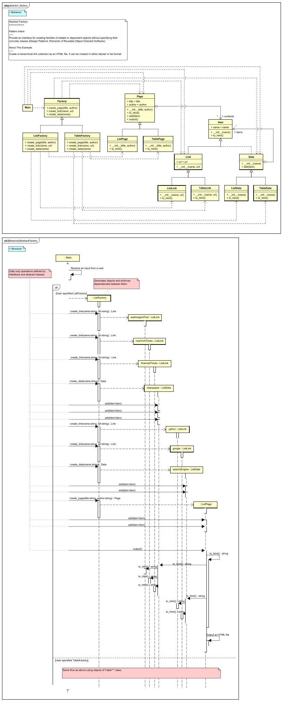</a> <a href="https://github.com/takaakit/design-pattern-examples-in-python/tree/master/creational_patterns/abstract_factory">Python Code</a> <a href="./creational_patterns/abstract_factory/execution_result.png">Execution Result</a> |  <a href="https://github.com/takaakit/design-pattern-examples-in-python/tree/master/creational_patterns/builder">Python Code</a> <a href="./creational_patterns/builder/execution_result.png">Execution Result</a> | <a href="https://htmlpreview.github.io/?https://github.com/takaakit/uml-diagram-for-python-design-pattern-examples/blob/master/creational_patterns/factory_method/diagram_map.html">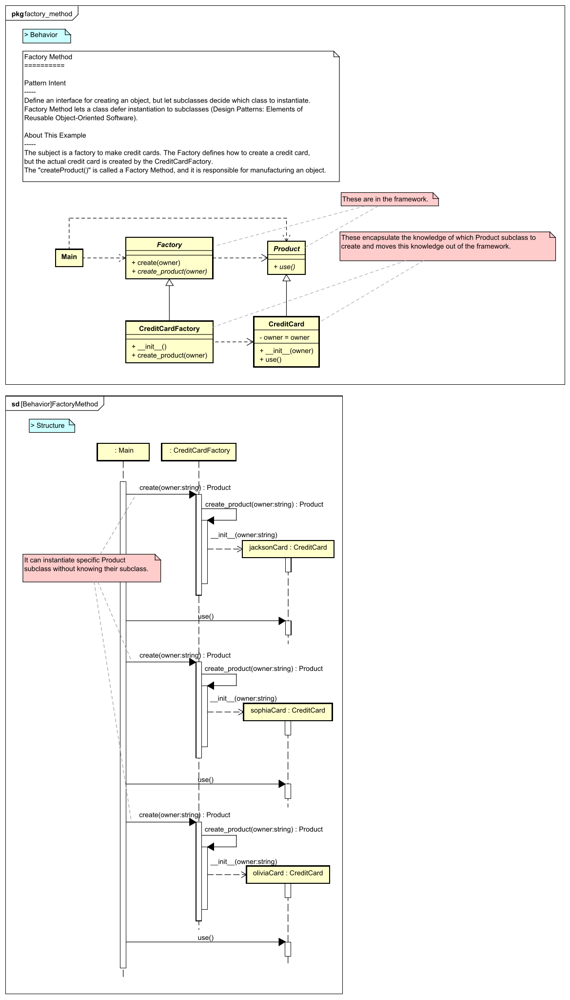</a> <a href="https://github.com/takaakit/design-pattern-examples-in-python/tree/master/creational_patterns/factory_method">Python Code</a> <a href="./creational_patterns/factory_method/execution_result.png">Execution Result</a> |
| **Prototype** | **Singleton** |  |
|  <a href="https://github.com/takaakit/design-pattern-examples-in-python/tree/master/creational_patterns/prototype">Python Code</a> <a href="./creational_patterns/prototype/execution_result.png">Execution Result</a> |  <a href="https://github.com/takaakit/design-pattern-examples-in-python/tree/master/creational_patterns/singleton">Python Code</a> <a href="./creational_patterns/singleton/execution_result.png">Execution Result</a> |  |

Structural Patterns
---
|  |  |  |
| :---: | :---: | :---: |
| **Adapter** | **Bridge** | **Composite** |
| <a href="https://htmlpreview.github.io/?https://github.com/takaakit/uml-diagram-for-python-design-pattern-examples/blob/master/structural_patterns/adapter/diagram_map.html">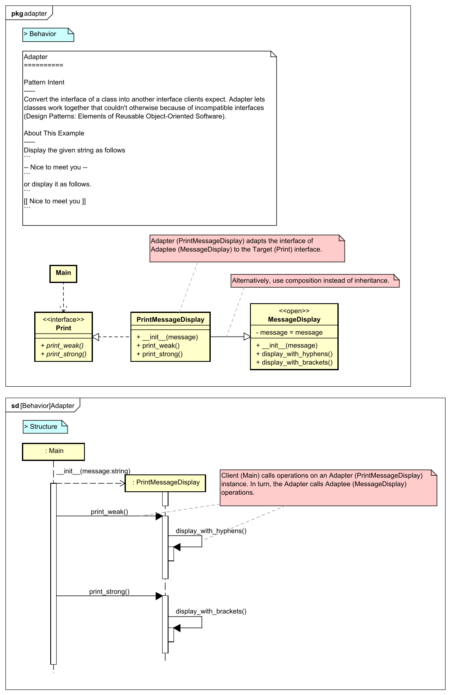</a> <a href="https://github.com/takaakit/design-pattern-examples-in-python/tree/master/structural_patterns/adapter">Python Code</a> <a href="./structural_patterns/adapter/execution_result.png">Execution Result</a> | <a href="https://htmlpreview.github.io/?https://github.com/takaakit/uml-diagram-for-python-design-pattern-examples/blob/master/structural_patterns/bridge/diagram_map.html">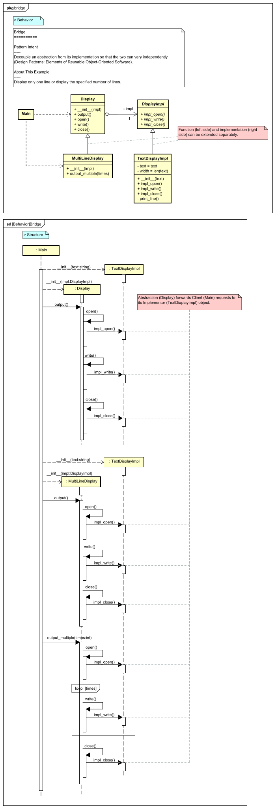</a> <a href="https://github.com/takaakit/design-pattern-examples-in-python/tree/master/structural_patterns/bridge">Python Code</a> <a href="./structural_patterns/bridge/execution_result.png">Execution Result</a> |  <a href="https://github.com/takaakit/design-pattern-examples-in-python/tree/master/structural_patterns/composite">Python Code</a> <a href="./structural_patterns/composite/execution_result.png">Execution Result</a> |
| **Decorator** | **Facade** | **Flyweight** |
|  <a href="https://github.com/takaakit/design-pattern-examples-in-python/tree/master/structural_patterns/decorator">Python Code</a> <a href="./structural_patterns/decorator/execution_result.png">Execution Result</a> | <a href="https://htmlpreview.github.io/?https://github.com/takaakit/uml-diagram-for-python-design-pattern-examples/blob/master/structural_patterns/facade/diagram_map.html">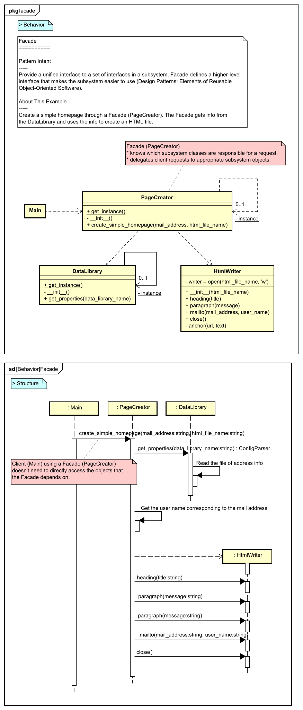</a> <a href="https://github.com/takaakit/design-pattern-examples-in-python/tree/master/structural_patterns/facade">Python Code</a> <a href="./structural_patterns/facade/execution_result.png">Execution Result</a> |  <a href="https://github.com/takaakit/design-pattern-examples-in-python/tree/master/structural_patterns/flyweight">Python Code</a> <a href="./structural_patterns/flyweight/execution_result.png">Execution Result</a> |
| **Proxy** |  |  |
| <a href="https://htmlpreview.github.io/?https://github.com/takaakit/uml-diagram-for-python-design-pattern-examples/blob/master/structural_patterns/proxy/diagram_map.html">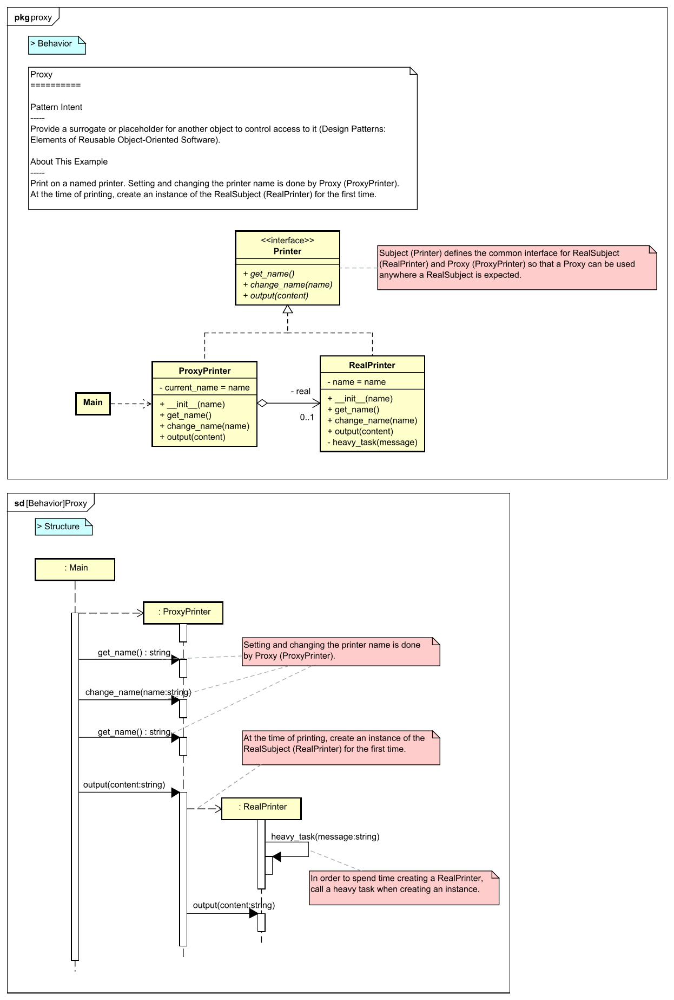</a> <a href="https://github.com/takaakit/design-pattern-examples-in-python/tree/master/structural_patterns/proxy">Python Code</a> <a href="./structural_patterns/proxy/execution_result.png">Execution Result</a> | | |

References
---
* Gamma, E. et al. Design Patterns: Elements of Reusable Object-Oriented Software, Addison-Wesley, 1994
* Hiroshi Yuki. Learning Design Patterns in Java [In Japanese Language], Softbank publishing, 2004

Links
---
* [Design Pattern Examples in Python](https://github.com/takaakit/design-pattern-examples-in-python)
* [Diagram Map: tracing UML/SysML elements across diagrams](https://dev.to/takaakit/diagram-map-tracing-uml-sysml-elements-across-diagrams-49i7)

License
---
Diagram Map file (diagram_map.html) includes the following libraries:
* [D3.js](https://d3js.org) is copyrighted by Mike Bostock and is released under the [BSD license](https://opensource.org/licenses/BSD-3-Clause).
* [Popper.js](https://popper.js.org) is copyrighted by Federico Zivolo and is released under the [MIT license](https://opensource.org/licenses/MIT).
* [Tippy.js](https://atomiks.github.io/tippyjs) is copyrighted by atomiks and is released under the [MIT license](https://opensource.org/licenses/MIT).
* [Chroma.js](https://gka.github.io/chroma.js) is copyrighted by Gregor Aisch and is released under the [BSD license](https://opensource.org/licenses/BSD-3-Clause).

Files and data in this project other than the above libraries are under the [Creative Commons Zero (CC0) license](https://creativecommons.org/publicdomain/zero/1.0/).

Other Language Examples
-----------------------
[C++](https://github.com/takaakit/uml-diagram-for-cpp-design-pattern-examples), [C#](https://github.com/takaakit/uml-diagram-for-csharp-design-pattern-examples), [Crystal](https://github.com/takaakit/uml-diagram-for-crystal-design-pattern-examples), [Go](https://github.com/takaakit/uml-diagram-for-golang-design-pattern-examples), [Java](https://github.com/takaakit/uml-diagram-for-java-design-pattern-examples), [JavaScript](https://github.com/takaakit/uml-diagram-for-javascript-design-pattern-examples), [Kotlin](https://github.com/takaakit/uml-diagram-for-kotlin-design-pattern-examples), [Ruby](https://github.com/takaakit/uml-diagram-for-ruby-design-pattern-examples), [Scala](https://github.com/takaakit/uml-diagram-for-scala-design-pattern-examples), [Swift](https://github.com/takaakit/uml-diagram-for-swift-design-pattern-examples), [TypeScript](https://github.com/takaakit/uml-diagram-for-typescript-design-pattern-examples)
